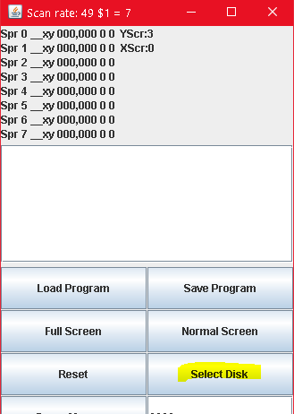

# *** This is A BAD HACK ****

...and a fork of Cat's Eye Technologies' own [ork](https://github.com/mzattera/JaC64) of JaC64 distribution on [SourceForge](https://sourceforge.net/p/jac64/).

Purpose of this fork is to add opcode logging feature to the emulator.

That is, the emulator will be able to log into a text file the list of opcodes being executed by the emulator.
Please notice that about 250'000 opcodes are logged in a second, hence the log file might grow huge.

As mentioned, this is a quick hack but works perfectly to provide opcode execution frequencies that can be used, for example, for optimization of emulators.

## Usage

1. You must have java 8 or higher installed on your machine to run the emulator.
2. Download `C64Test.jar` contained in the release.
3. Download C64 ROMs from the [original Sourceforge distro](https://sourceforge.net/p/jac64/code/HEAD/tree/roms/) and store them within a "`roms`" folder in the same location where you saved `C64Test.jar` file.
4. Launch the emulator by invoking java command line: `java -jar C64Test.jar`.
5. In the emulator GUI, click "Select Disk" and choose a C64 floppy image in `.D64` format.

   
   
6. The list of files on the floppy will appear in the GUI, double click on one to load and run it.
   
   
   
7. By default logging of opcodes is disabled; there is a toggle button on the bottom of the GUI to toggle it on or off.
   
   
   
8. When you will exit the emulator, you can find a text file named `opcodes.txt` that will list opcodes excuted by the emulator, one per line.
*The file is overwritten at each run of the emulator*.

